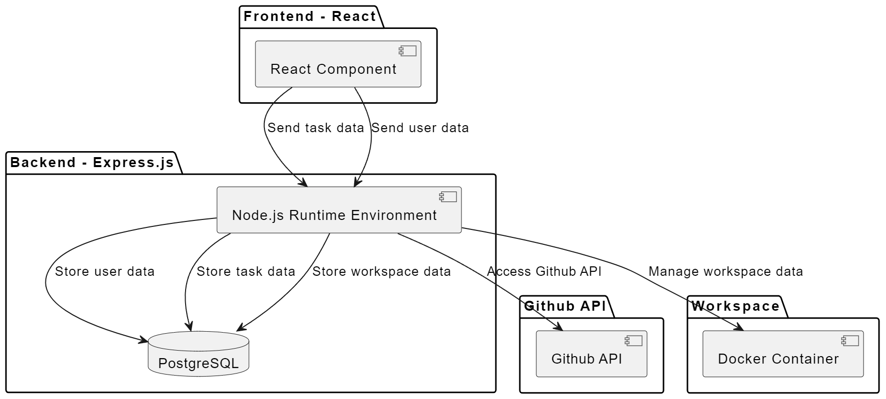
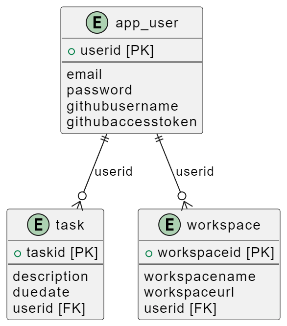
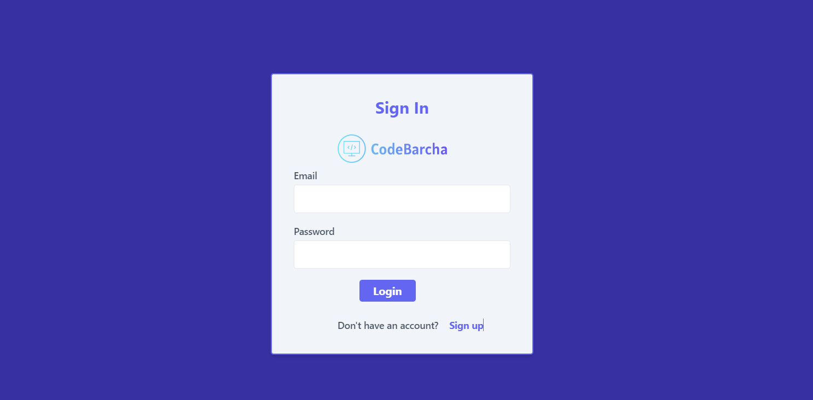
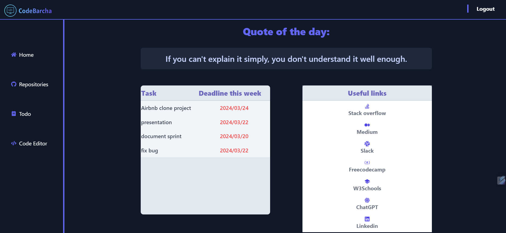
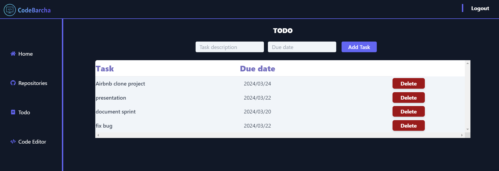
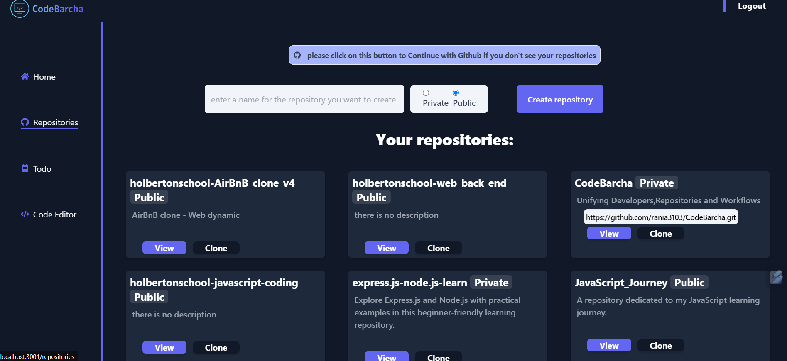
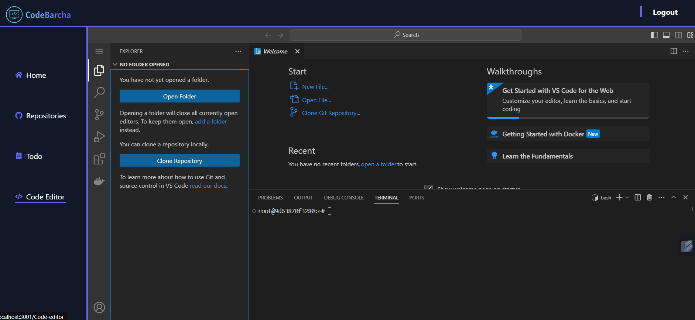

<a name="readme-top"></a>
<div align="center">
  <!-- You are encouraged to replace this logo with your own! Otherwise you can also remove it. -->
  
  <br/>
</div>

<!-- PROJECT DESCRIPTION -->
# 💻CodeBarcha

> **CodeBarcha** is a comprehensive workspace designed to enhance coding workflows and manage repositories..
> 
## 🛠 Built With

### 📑Tech Stack

<details>
  <summary>Client</summary>
  <ul>
    <li><a href="https://reactjs.org/">React.js</a></li>
  </ul>
</details>
<details>
  <summary>Server</summary>
  <ul>
    <li><a href="https://expressjs.com/">Express.js</a></li>
  </ul>
</details>
<details>
<summary>Database</summary>
  <ul>
    <li><a href="https://www.postgresql.org/">PostgreSQL</a></li>
  </ul>
</details>

### 🔧Architecture🔨





<!-- Features -->

### 🔎Key Features <a name="key-features"></a>
- **GitHub integration:** View your repositories, create a repository on GitHub.
- **Code Editor:** An integrated IDE to code, execute code, support git and many programming languages and other features.
- **Task Management:** View, create, update, and delete tasks.
<p align="right">(<a href="#readme-top">back to top</a>)</p>
<!-- LIVE DEMO -->

## 🚀 Live Demo







<p align="right">(<a href="#readme-top">back to top</a>)</p>
<!-- GETTING STARTED -->

## 💻 Getting Started

### Prerequisites

In order to run this project, you need:
- Node.js
- npm
- PostgreSQL
- Docker

### Setup

1. Clone this repository to your desired folder:
    ```sh
    cd my-folder
    git clone git@github.com:rania3103/CodeBarcha.git
    ```

2. Navigate to the project directory:
    ```sh
    cd CodeBarcha
    ```
3. Navigate to the backend directory:
    ```sh
    cd backend
    ```
4. Install dependencies:
    ```sh
    npm install
    ```
5. Run the backend:
    ```sh
    npm run start
    ```
6. Navigate to the frontend directory:
    ```sh
    cd frontend
    ```
7. Install dependencies:
    ```sh
    npm install
    ```

8. Run the frontend:
    ```sh
    npm run dev
    ```
<p align="right">(<a href="#readme-top">back to top</a>)</p>
<!-- AUTHORS -->

## 👥 Authors

- GitHub: [@rania3103](https://github.com/rania3103)
- LinkedIn: [LinkedIn](https://linkedin.com/in/rania-abassi-24105a249)
<p align="right">(<a href="#readme-top">back to top</a>)</p>
<!-- FUTURE FEATURES -->

## 🔭 Future Features

- [ ] **Chat App:** Integrate a real-time chat application for enhanced collaboration.

<p align="right">(<a href="#readme-top">back to top</a>)</p>
<!-- CONTRIBUTING -->

## 🤝 Contributing

Contributions, issues, and feature requests are welcome!
Feel free to check the [issues page](../../issues/).
<p align="right">(<a href="#readme-top">back to top</a>)</p>

